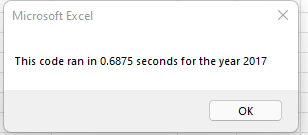
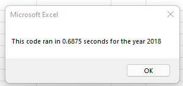
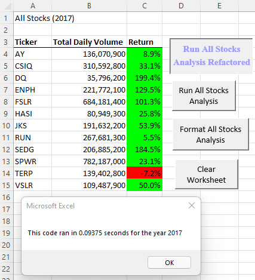
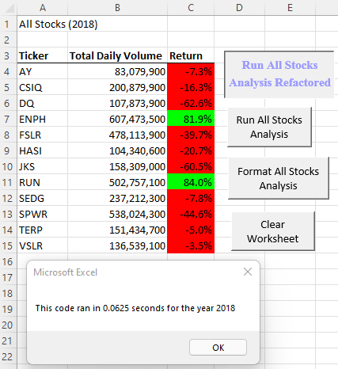

# Stock_Analysis 

## Purpose
**PICK THE BEST STOCKS** ~ To do that I took the 2017 and 2018 daily open and close prices from 12 different stocks and found their overall return percentage per year.  Then, I formatted the results so the positive stocks stood out in [go] green and the failing stocks in [negative] red. Lastly, I refactored the macro to be capable of performing this analysis on the entire stock market. 

## Results

**STOCK PERFORMANCE** ~ Since the number of green colored stocks (indicating an overall positive return) went from 11 out of 12 in 2017, to only 2 out of 12 in 2018, there was most likely a dip in the market.  Or if this group of tickers are from one particular industry, then it is possible only this specific industry had a dip. The glass-half-full perspective is 2017 was an overly-eager/bull market and the 2018 numbers go back to a base/bear market.  In buying stocks, it is important to not just look at change over one year, but over several years. Note: When choosing stocks, other factors should be taken into account like personal risk tolerance and more research on the "winners" like ENPH and RUN to see if they are overpriced.

**MACRO PERFORMANCE** ~ The original 0.6785 second macro run-time compared to the 0.09375 refactored macro run-time may not seem like a big difference, but for the 2017 & 2018 macros this is actually a 86% & 91% difference. 

 
 

## In Sum
The time it took to refactor this code (about an hour) will pay for itself in time when trying to analyze the entire market every year to pick out the best. According to Investopedia, there are 630,000 publicly-traded companies around the world[^2]. Usually, to know a company's stock strength you would view their last 5-10 years history. Lets be kind and use 5 years. This takes our 24 findings (12 stocks x  2 years) and increases it to 3,150,000 findings (630,000 stocks x 5 years). (And I'm sure you'll need to build another comparison table or chart to help filter those findings, but for now lets just stop here.) The original macro would take 24.74 hours to run, but the refactored macro would take only 3.42 hours to run! Wow, that's a lot of "company time!" 

**The CONS of refactoring VBA script:**
1. That feeling of "wasting time" up front just to SAVE TIME in the long-run 
2. Fear/dread of having to re-code an already working macro, opening possibilities of breaking it.  

**The PROS of refactoring VBA script:**
1. Save time running the macro, especially when working with large quantities of data
2. Utilize Git Bash to save versions of edits without the risk of overwriting edits you many need to reference back to
3. Utilize VS Code to make drafting sections of code easier to read and write 

[^1]: [Investopedia. "Stock Exchanges Around the World". Accessed Dec. 3, 2021](https://www.investopedia.com/financial-edge/1212/stock-exchanges-around-the-world.aspx)
